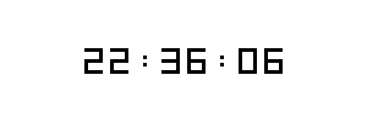

# GIF clock

## Overview

This project demonstrates how to generate animated GIF images directly in a Cloudflare Worker using Rust. Since Cloudflare Workers don't have access to the Canvas API or other image generation libraries, this project uses a pure Rust implementation to:

1. Create a digital clock that displays the current time in HH:MM:SS format
2. Generate an animated GIF that updates every second
3. Serve this dynamic content through a Cloudflare Worker

## How It Works

The implementation uses:

- Rust's `gif` crate to create and encode GIF images
- A custom bitmap font renderer to draw the digital clock digits
- Cloudflare Workers' Rust SDK to handle HTTP requests and serve the generated GIF

The clock is rendered using a simple 5x7 pixel bitmap font that's scaled up for better visibility. Each digit is drawn pixel by pixel into a buffer, which is then encoded as a GIF frame. Multiple frames are generated to create the animation effect of a ticking clock.

## Demo

Deploy this worker to see a continuously updating digital clock that shows the current time. The GIF automatically refreshes to keep the time current. Sample output:

### UPDATE

Now it counts down to a place in time. It also has a lato font

Incoming request uri will look like this:
`/?countdown_to=2025-11-28T17:00:00Z`

## Instructions

Setup your environment with cloudflare [docs](https://developers.cloudflare.com/workers/languages/rust/). At time of writing, these were the steps to take:

1. Install rust globally
1. Install npm globally
1. Install wrangler globally
1. `rustup target add wasm32-unknown-unknown`
1. `cargo install cargo-generate`
1. pull this repo

To do local debugging: `npx wrangler dev`. It may take time on the first run.

If you have workers enabled on your CF account, you can deploy it with `npx wrangler deploy`. It will deploy to {name}.{your-account}.workers.dev.

Cheers 🍻
